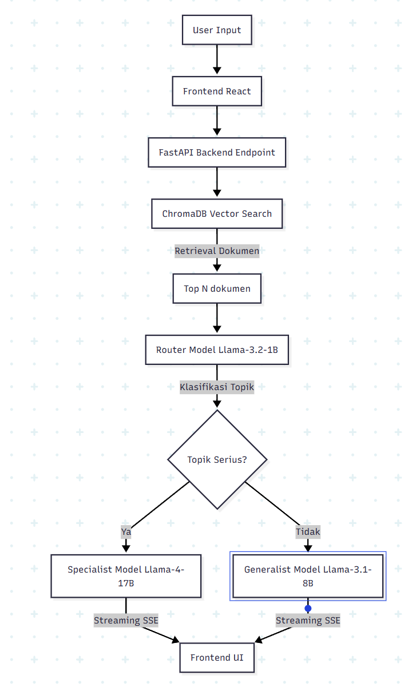

# Dokumentasi RAG-Chatbot

Dokumen ini berisi penjelasan komprehensif mengenai arsitektur, alur data, dan detail teknis dari proyek RAG-Chatbot.

## 1. Arsitektur Sistem

Sistem RAG-Chatbot ini dibangun menggunakan arsitektur *client-server* moduler dengan pemisahan antara frontend dan backend:

- **Frontend**: Dibangun menggunakan **React**, **Vite**, **TypeScript**, dan **TailwindCSS** (beserta komponen shadcn/ui). Frontend bertugas menangani interaksi pengguna, upload dokumen, dan merender respons dari AI secara *real-time* dengan format Markdown.
- **Backend**: Dibangun menggunakan **FastAPI** (Python 3.14+). Backend menangani logika API, *streaming* Server-Sent Events (SSE), manajemen file, serta orkestrasi pemrosesan NLP.
- **Vector Database**: Menggunakan **ChromaDB** yang berjalan secara lokal untuk menyimpan *embeddings* dari dokumen (korpus) guna mendukung pencarian konteks.
- **LLM Engine**: Sistem ini tidak hanya menggunakan satu model, melainkan menerapkan sistem **Router** dengan model ganda (Generalist dan Specialist) untuk mengoptimalkan kinerja dan akurasi berdasarkan topik pertanyaan pengguna.

## 2. Diagram Alur Data

### Alur Endpoint Chat

Secara garis besar, aliran data dari saat *user* bertanya hingga mendapatkan jawaban adalah sebagai berikut:

**Penjelasan Alur:**

1. Pengguna memasukkan pertanyaan melalui Frontend.
2. Backend menerima kueri dan secara paralel melakukan pencarian konteks di **ChromaDB** (*Vector Search*).
3. Di saat yang sama, kueri dikirim ke **Router Model** untuk diklasifikasikan apakah itu topik umum atau topik spesifik/serius (seperti medis, teknis, hukum).
4. Hasil dokumen relevan dari ChromaDB dirangkai menjadi konteks (*context*).
5. Berdasarkan hasil Router, kueri + konteks dikirimkan ke model **Specialist** (jika topik serius) atau **Generalist** (jika topik biasa).
6. Model menghasilkan respons secara *streaming* dan langsung dikirim kembali ke pengguna.

### Alur Endpoint Upload File

Secara garis besar, aliran data dari saat *user* upload file hingga mendapat status upload adalah sebagai berikut:

**Penjelasan Alur:**

1. Pengguna mengunggah file PDF ke dalam frontend
2. Backend melakukan validasi ekstensi file (hanya .txt dan .pdf yang diizinkan).
3. Jika ekstensi tidak didukung, sistem melempar HTTPException dan mengembalikannya ke user.
4. Jika didukung, file di-parsing dan disimpan ke Local Disk.
5. Setelah itu, baca konten file dan lakukan Recursive Chunking.
6. Lakukan proses embedding menggunakan model all-MiniLM-L6-v2 dan simpan ke ChromaDB.
7. Terakhir, kembalikan respon berupa status, jumlah chunk, dan isi konten file ke user.

## 3. Penjelasan RAG Pipeline

Pipeline *Retrieval-Augmented Generation* (RAG) pada proyek ini terbagi menjadi dua fase:

- **Fase Ingestion (Pemasukan Dokumen):**
  1. Dokumen (contoh: PDF) diunggah pengguna.
  2. Teks di dalam dokumen diekstraksi (menggunakan pustaka seperti `pdfminer.six`).
  3. Teks dipecah menjadi potongan-potongan (*chunks*).
  4. Setiap *chunk* diubah menjadi *vector embeddings* menggunakan model embedding `all-MiniLM-L6-v2`.
  5. Vektor dan metadata dokumen disimpan di **ChromaDB**.

- **Fase Retrieval & Generation (Pencarian & Pembuatan Jawaban):**
  1. Kueri dari pengguna juga diubah menjadi *vector embeddings* oleh model embedding yang sama.
  2. Sistem mencari `Top-K` *chunks* dokumen di ChromaDB yang memiliki kemiripan vektor (*cosine similarity*) terdekat dengan kueri.
  3. *Chunks* tersebut disisipkan ke dalam *System Prompt* sebagai konteks.
  4. LLM membaca *Prompt* dan menjawab pertanyaan pengguna murni berdasarkan konteks yang diberikan.

## 4. Alasan Pemilihan Model & Teknologi

- **FastAPI**: Sangat ringan, asinkron (*async*), dan cepat. Sangat cocok untuk host endpoint *streaming* SSE dari LLM.
- **React & Vite**: Ekosistem modern yang sangat cepat dalam proses *build*, mendukung komponen reaktif seperti indikator pengetikan, formating Markdown, dan *highlighting* sintaks kode secara *real-time*.
- **ChromaDB**: *Vector database* ini tidak memerlukan *setup server* khusus (*serverless/local*) dan ringan. Setup untuk ChromaDB juga cukup mudah dan tidak memerlukan banyak konfigurasi.
- **Sistem Model Router**:
  - **Llama-3.2-1B-Instruct (Router)**: Berukuran sangat kecil dan responsif, digunakan murni untuk klasifikasi query dari pengguna dalam waktu yang singkat.
  - **Llama-4-Scout-17B-16E-Instruct (Specialist)**: Model besar dan cerdas, mampu menangani penalaran logika yang kompleks untuk pertanyaan berat (Hukum, IT, Medis).
  - **Llama-3.1-8B-Instruct (Generalist)**: Cukup mumpuni untuk percakapan sehari-hari, *small talk*, atau ringkasan sederhana tanpa membebani *resource* komputasi.
- **all-MiniLM-L6-v2**: Model *embedding* dari HuggingFace yang sangat ringan namun memiliki akurasi yang solid untuk perbandingan makna (*semantic search*).

## 5. Cara Menjalankan Proyek (Step-by-Step)

Berikut adalah langkah-langkah untuk menjalankan RAG-Chatbot secara lokal:

**Prasyarat:**

- Python versi 3.14 atau ke atas.
- Node.js versi 18+ dan NPM/Yarn.
- Dependensi manajemen berbasis pip atau `uv`.

**Langkah Menjalankan Backend:**

1. Buka terminal dan masuk ke direktori backend: `cd src/backend`
2. Atur *environment variables* di dalam file `.env` (masukkan konfigurasi model LLM Anda).
3. Instal semua dependensi menggunakan package manager yang Anda pilih (misal uv): `uv sync`.
4. Jalankan server FastAPI dengan uvicorn:

   ```bash
   fastapi dev main.py
   # atau
   uvicorn main:app --reload --port 8000
   # atau
   uv run fastapi
   ```

**Langkah Menjalankan Frontend:**

1. Buka terminal baru dan masuk ke direktori frontend: `cd src/frontend`
2. Instal semua package Node.js:

   ```bash
   npm install
   ```

3. Jalankan *development server* Vite:

   ```bash
   npm run dev
   ```

4. Buka browser dan navigasikan ke `http://localhost:5173`.

## 6. Trade-off Teknis

- **Pemisahan Model (Routing) vs Single Model:**
  - *Pro*: Menghemat biaya dan komputasi secara signifikan karena tidak semua kueri dikirim ke model berbobot besar.
  - *Kontra*: Terdapat sedikit penundaan (latensi) awal karena kueri harus diklasifikasikan oleh *router* sebelum dialihkan ke LLM utama.
- **ChromaDB Local vs VectorDB Cloud (Pinecone/Weaviate):**
  - *Pro*: Data 100% tersimpan secara lokal dan privasi terjamin; tanpa ada batasan biaya API tambahan.
  - *Kontra*: Kurang skalabel jika beban mencapai skala masif, dan ukuran penyimpanan bergantung langsung pada *disk space* server.

## 7. Limitasi Sistem

1. **Ekstraksi Teks PDF Gambar**: Jika dokumen PDF di-save dari format gambar (hasil scan tanpa layer teks), sistem saat ini (`pdfminer.six`) tidak dapat mengekstraksi teksnya karena tidak menggunakan modul *Optical Character Recognition* (OCR).
2. **Penimpaan File (Overwrite)**: Jika Anda mengunggah file baru dengan nama yang persis sama dengan yang ada, sistem akan langsung menimpa file lama di sistem lokal.
3. **Konflik Router**: Pada pertanyaan ambigu, model router 1B bisa salah mengenali kategori sehingga melempar responsnya ke Generalist, meskipun sebetulnya perlu keahlian teknis (Specialist).

## 8. Rencana Pengembangan Lanjutan

1. **Database Riwayat Percakapan**: Menambahkan *database relasional* (seperti PostgreSQL/SQLite) untuk menangkap UUID *chat* dan menyimpan riwayat percakapan agar *user* bisa melanjutkan sesi mereka kapanpun.
2. **Evaluasi Kustom RAG**: Mengembangkan sistem evaluasi kustom yang membaca dataset pengujian dari `evaluation.jsonl` dan membandingkan *retrieved contexts* dan *response* model dengan jawaban referensi tanpa bergantung pada modul eksternal RAGAS.
3. **Peningkatan Chunking**: Menerapkan metode *recursive chunking* pada pemrosesan dokumen untuk memecah teks berdasarkan semantik dan struktur alih-alih pemotongan karakter statis.
4. **Fine-Tuning (LoRA)**: Melanjutkan inisiatif *fine-tuning* (direktori `loramodel` telah disiapkan) dengan LoRA pada model untuk secara spesifik mengenali gaya bahasa atau kueri khusus domain industri.
5. **Integrasi Ekstraksi OCR**: Menambahkan modul tambahan seperti Tesseract/PyTesseract agar sistem sanggup membaca isi gambar di dalam PDF yang diunggah.
