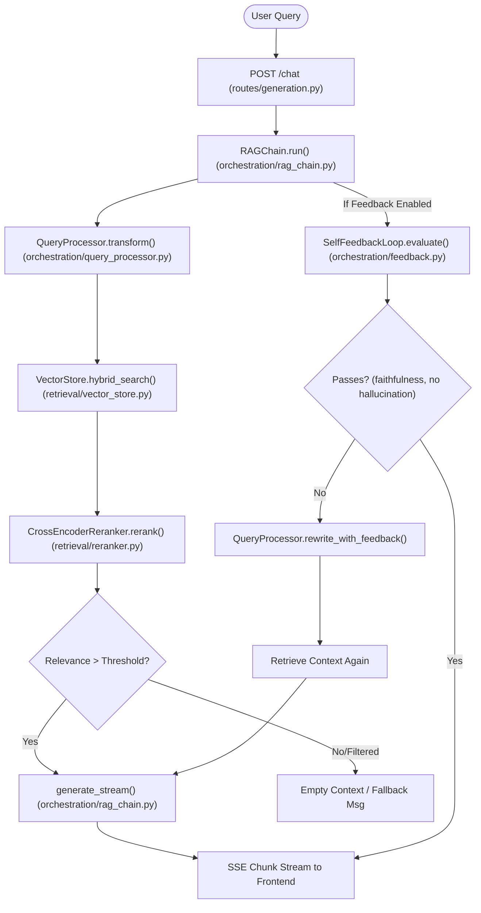

# 🌌 RAG Chatbot System

A premium, full-stack Retrieval-Augmented Generation (RAG) system featuring an asynchronous FastAPI backend and a Vite-powered React frontend. Designed with a focus on factuality, transparency, and low-latency performance.

---

## 🌟 Key Features

- **Hybrid Retrieval Ensemble**: Combines BM25 lexical search and Chroma Vector Store semantic search to optimize candidate selection.
- **Cross-Encoder Reranking**: Filters candidates using `BAAI/bge-reranker-v2-m3` based on relevance score thresholding to isolate contextually rich information.
- **Query Transformation Strategy**: Employs classification, query rewriting, decomposition, and HyDE (Hypothetical Document Embeddings) using a fast router model.
- **Named Entity Recognition (NER) Enrichment**: Extracts metadata from documents and queries using multilingual BERT-based models (`bert-base-NER` for English, cached Indonesian BERT for Indonesian) to tag context.
- **Real-Time Self-Feedback Loop**: Validates LLM responses using a Critic model across six dimensions. Rewrites and re-retrieves context dynamically on failures.
- **Interactive RAG Tracing**: Streams SSE (Server-Sent Events) tokens to the UI while collecting detailed tracing data (latency, exact retrieval hits, reranker scores, and feedback critiques) for analytical auditing.
- **Offline Evaluation Suite**: Measures pipeline effectiveness using precision@5, recall@5, Mean Reciprocal Rank (MRR), token overlap similarity, and feedback stats.

---

## 📐 Architecture & Layer Map

The backend separates layers to ensure unit-testability. The `core/` folder is framework-agnostic (containing zero FastAPI or database dependencies).

```
RAG-Chatbot/
├── src/
│   ├── app/                    # FastAPI Backend Source
│   │   ├── api/                # API Routing and Controller Handlers
│   │   │   └── routes/         # HTTP and Server-Sent Event Endpoints
│   │   ├── core/               # Framework-Agnostic Core Processing
│   │   │   ├── orchestration/  # RAG Pipeline and Self-Feedback Execution
│   │   │   ├── retrieval/      # Vector Store Operations and Reranking
│   │   │   ├── pipeline/       # Chunker, Loader, Embedder, and NER
│   │   │   └── generation/     # LLM Inference and Prompt Templating
│   │   ├── entity/             # SQLAlchemy Async Database Entities (aiosqlite)
│   │   ├── models/             # Pydantic v2 Serialization Schemas
│   │   └── services/           # Singleton Lifecycles and Business Logic
│   └── frontend/               # React + TypeScript Frontend Application
```

### Flow of a Chat Request


```mermaid
graph TD
    User([User Query]) --> Route["POST /chat (routes/generation.py)"]
    Route --> RAG["RAGChain.run() (orchestration/rag_chain.py)"]
    RAG --> Transform["QueryProcessor.transform() (orchestration/query_processor.py)"]
    Transform --> Hybrid["VectorStore.hybrid_search() (retrieval/vector_store.py)"]
    Hybrid --> Rerank["CrossEncoderReranker.rerank() (retrieval/reranker.py)"]
    Rerank --> Threshold{"Relevance > Threshold?"}
    Threshold -- Yes --> Gen["generate_stream() (orchestration/rag_chain.py)"]
    Threshold -- No/Filtered --> Fallback["Empty Context / Fallback Msg"]
    Gen --> Stream["SSE Chunk Stream to Frontend"]
    
    %% Feedback Sub-loop
    RAG -- If Feedback Enabled --> Feedback["SelfFeedbackLoop.evaluate() (orchestration/feedback.py)"]
    Feedback --> Passes{"Passes? (faithfulness, no hallucination)"}
    Passes -- Yes --> Stream
    Passes -- No --> Rewrite["QueryProcessor.rewrite_with_feedback()"]
    Rewrite --> ReRetrieve["Retrieve Context Again"]
    ReRetrieve --> Gen
```

---

## 🛠️ Components Directory & File Index

The following table links directly to key components and system layers:

| Component / Layer | Description | Target File Path |
| :--- | :--- | :--- |
| **System Settings** | Manages Hugging Face authentication, model profiles, and RAG thresholds. | [config.py](file:///c:/Project/RAG-Chatbot/src/app/config.py) |
| **RAG Pipeline Engine** | Connects retrieval, query transformation, LLM generation, and feedback execution. | [rag_chain.py](file:///c:/Project/RAG-Chatbot/src/app/core/orchestration/rag_chain.py) |
| **Self-Feedback Logic** | Evaluates answers against context across 6 core criteria via LLM critique. | [feedback.py](file:///c:/Project/RAG-Chatbot/src/app/core/orchestration/feedback.py) |
| **Feedback Data Models** | Houses evaluation schemas and criteria for checking hallucinations. | [feedback.py](file:///c:/Project/RAG-Chatbot/src/app/models/feedback.py) |
| **Developer Reference** | Contains CLI commands, linting configurations, and development guidelines. | [CLAUDE.md](file:///c:/Project/RAG-Chatbot/CLAUDE.md) |
| **Configuration Setup** | Defines environment variable fields required to execute the workspace locally. | [.env.example](file:///c:/Project/RAG-Chatbot/.env.example) |
| **Batch Ingestion Script** | Automates file ingestion, document loading, token chunking, and metadata parsing. | [batch_ingest.py](file:///c:/Project/RAG-Chatbot/tools/batch_ingest.py) |
| **Pipeline Evaluation** | Runs batch testing against a query collection and prints analytical metrics. | [evaluate.py](file:///c:/Project/RAG-Chatbot/tools/evaluate.py) |
| **Evaluation Queries** | Contains target queries, expected answers, and ground-truth documents. | [eval_queries.json](file:///c:/Project/RAG-Chatbot/tests/eval_queries.json) |

---

## 🚀 Setup & Execution

### Prerequisites

- **Python 3.11+** with `uv` package manager installed.
- **Node.js** and **npm** for running the frontend developer assets.
- An **HF Token** to authenticate models running on the Hugging Face Inference API.

### Environment Configuration

Configure secrets by copying the env template:

```bash
cp .env.example .env
```

Ensure the following variables are filled in inside your `.env`:
- `HF_TOKEN`: Hugging Face User Access Token (API permissions).
- `JWT_SECRET_KEY`: Random string for JWT verification tokens.

Non-sensitive default knobs (such as model definitions and paths) can be modified in [config.py](file:///c:/Project/RAG-Chatbot/src/app/config.py) or overridden in `.env`.

---

## 💻 Running the Application

### 1. Launching the Backend

Navigate to the application folder and run the developer server:

```bash
cd src/app
uv run fastapi dev
```

FastAPI automatically initializes the database files and configures the Chroma database directories upon starting. To display your configuration settings as parsed:

```bash
uv run python config.py
```

### 2. Launching the Frontend

Navigate to the frontend folder, install packages, and boot Vite:

```bash
cd src/frontend
npm install
npm run dev
```

Open your browser at `http://localhost:5173`. The UI includes:
- **Dashboard**: Overview of conversational states.
- **Chat Interface** ([Chat.tsx](file:///c:/Project/RAG-Chatbot/src/frontend/src/pages/Chat.tsx)): Interactive prompt input displaying RAG logs, evaluation critiques, and model parameters.
- **Document Manager** ([Files.tsx](file:///c:/Project/RAG-Chatbot/src/frontend/src/pages/Files.tsx)): Screen to upload and ingestion-index system files.

---

## 🧰 Tools & Utilities

### 📥 Document Ingestion

You can ingest documents (supporting PDF, MD, TXT, and JSONL formats) locally using the batch tool:

```bash
cd src/app
# Run batch ingestion on a local directory
uv run python ../../tools/batch_ingest.py path/to/documents/ --language en

# Skip NER enrichment during ingestion
uv run python ../../tools/batch_ingest.py path/to/document.pdf --no-ner
```

The script chunks text, performs NER tagging, computes content hashes to prevent duplicate upserts, maps base metadata, inserts the vectors into Chroma, and rebuilds the BM25 lexical search index.

### 🧪 Pipeline Evaluation

Run offline evaluation against a curated test dataset to test retrieval and answer quality:

```bash
uv run python tools/evaluate.py tests/eval_queries.json --output report.json
```

**Parameters supported:**
- `--top-k`: Number of candidate chunks to fetch (default: 10).
- `--threshold`: Relevance score limit below which documents are filtered out.
- `--self-feedback`: Toggle on the self-feedback critique loops during the test run.
- `--output` / `-o`: Write a full JSON report containing per-query metrics to this path.

The script prints a detailed console summary of the results:
- **Latency metrics**: Mean, minimum, and maximum latency for query retrieval, cross-encoder rerank, and LLM text generation.
- **Tokens stats**: Prompt vs. completion tokens.
- **Retrieval accuracy**: Precision@5, Recall@5, and Mean Reciprocal Rank (MRR) based on ground-truth documents.
- **Answer accuracy**: Token overlap similarity score against the target baseline answer.
- **Critic analytics**: Average faithfulness, relevance, completeness, composite scores, and rate of detected hallucinations.
